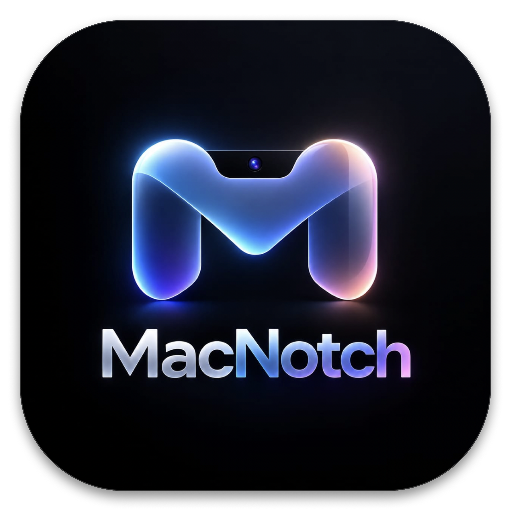

<div align="center">



# MacNotch
### The Ultimate Dynamic Island Experience for macOS

[](https://apple.com/macos)
[](https://swift.org)
[](https://apple.com)
[](LICENSE)

<p align="center">
  <b>Transform your MacBook's camera notch into a living, fluid, interactive hub.</b><br/>
  Featuring real-time media controls with reactive audio visualizers, active call radar, drag-and-drop file shelf, live sports scores, smart clipboard history, and seamless system HUD replacements.
</p>

<p align="center">
  <a href="#-download--installation"><b>📦 Download .DMG</b></a> •
  <a href="#-features--capabilities"><b>✨ Features</b></a> •
  <a href="#%EF%B8%8F-keyboard-shortcuts"><b>⌨️ Shortcuts</b></a> •
  <a href="#%EF%B8%8F-building-from-source"><b>🛠️ Build from Source</b></a> •
  <a href="#-privacy--architecture"><b>🔒 Privacy</b></a>
</p>

---

</div>

<br/>

## 🌟 Why MacNotch?

MacBook displays with camera notches have plenty of unused screen real estate around the bezel. **MacNotch** turns that black cutout into a powerful, elegant, physics-based Dynamic Island that feels like an organic part of macOS:

- 🪶 **Ultra Lightweight & Native**: Built 100% in Swift and SwiftUI with fluid interactive spring physics.
- 🖤 **True OLED Deep Black**: Seamlessly blends into the physical display bezel with zero grey halos or awkward borders.
- ⚡️ **Zero Battery Drain**: Native event-driven architecture that sleeps when idle (<0.2% background CPU).
- 🔒 **100% Private & On-Device**: No analytics, telemetry, or network tracking.

---

## 📦 Download & Installation

### Option 1: Direct DMG Download (Recommended)

1. Download the latest **[`MacBookNotch.dmg`](https://github.com/madankalyan2211/MacBook-Notch/releases/latest)**.
2. Double-click the downloaded **`MacBookNotch.dmg`**.
3. **Drag `MacBookNotch` into your `Applications` folder**.
4. Open **Applications** in Finder, **Right-click (Control-click) `MacBookNotch`**, and select **Open** (required for first-launch gatekeeper approval).

```
┌─────────────────────────────────────────────────────────────┐
│                       MacBookNotch.dmg                      │
│                                                             │
│       ┌───────────────┐               ┌───────────────┐     │
│       │  [MacNotch]   │   ─────────▶  │ [Applications]│     │
│       └───────────────┘               └───────────────┘     │
│       MacBookNotch.app                Applications Folder   │
└─────────────────────────────────────────────────────────────┘
```

> **Tip**: To launch automatically whenever your Mac starts:  
> Open **System Settings ➔ General ➔ Login Items** and add **MacBookNotch** under *Open at Login*.

---

## ✨ Features & Capabilities

### 🎵 1. Universal Media Player & Audio Visualizer
- **Supported Sources**: Spotify, Apple Music, Chrome / Brave / Edge (YouTube, Netflix, Prime Video, Podcasts).
- **Reactive Equalizer**: Dual-ear live frequency audio visualizer waveform directly dancing around the physical camera hole.
- **Interactive Scrubber**: Click and drag to seek track progress, play/pause, skip forwards/backwards, and view hi-res album art.

---

### 📞 2. Live Call Radar & VoIP HUD
- **Supported Apps**: FaceTime, Zoom, Microsoft Teams, Google Meet, WhatsApp, Slack Huddles, Webex.
- **Live In-Notch Controls**: Real-time microphone audio visualizer, call duration stopwatch, 1-click mute toggle, and hangup.

---

### 🗂️ 3. Notch Drop Shelf & AirDrop Stash
- **Drag-to-Notch**: Drag files, photos, or URLs directly onto the notch to park them on a spring-loaded temporary shelf.
- **Auto-Stash**: Automatically captures newly taken screenshots and downloads for instant drag-and-drop into emails, messages, or AirDrop.

---

### ⚽️ 4. Live Sports Scores Ticker
- **Supported Leagues**: Premier League (EPL), NBA, Formula 1 Grand Prix, International Cricket (ICC), Champions League.
- **Dynamic Events**: Live score counters, match minute tickers, goal bursts, and checkered flag alerts.

---

### ✍️ 5. Apple Signature "hello" Greeting
- **Iconic Animations**: Plays Apple's cursive handwriting welcome animation upon startup or on demand.
- **3 Dynamic Themes**: *Classic Cursive Handwriting*, *Neon Aurora Wave*, and *Liquid 3D Glass*.

---

### 🛡️ 6. In-Notch Interactive Permissions Card
- **Sleek Onboarding**: Clean, frosted glass rounded-rectangle card in expanded mode.
- **One-Click Consent**: Fast setup for Accessibility, Media Automation, Location (Weather), and Bluetooth (AirPods).

---

### 🔊 7. Native HUD Replacement
- **Seamless System Interceptor**: Replaces the intrusive stock macOS square HUD popups with sleek, fluid Dynamic Island pills for:
  - **Volume Slider** (with Mute indicator)
  - **Display Brightness Slider**
  - **Caps Lock Key** (Glowing green LED status indicator)
  - **MagSafe Charging & Battery Level**

---

### 📋 8. Smart Clipboard & Utilities
- **Clipboard Preview**: Live pill popup showing copied text, hex colors, and URL links with 1-click re-copy or browser launch.
- **AirPods & Bluetooth**: Real-time battery status for AirPods, Case, headphones, and wireless peripherals.
- **Caffeine Mode**: 1-click toggle to keep your display awake during presentations or downloads.
- **Live Timer & Voice Memo**: Countdown focus timer with visual progress ring and quick audio recording.
- **Ambient Weather**: Minimalist idle forecast showing live temperature, conditions, and precipitation.

---

## ⌨️ Global Keyboard Shortcuts

| Shortcut | Action | Description |
| :--- | :--- | :--- |
| **`⌥ H`** *(Option + H)* | **"hello" Greeting** | Triggers the iconic animated Apple cursive signature |
| **`⌥ C`** *(Option + C)* | **Call HUD** | Displays active conference call status or simulation |
| **`⌥ R`** *(Option + R)* | **Voice Memo** | Starts a quick voice memo audio recording with waveform |
| **`⌥ D`** *(Option + D)* | **Focus Mode** | Toggles Do Not Disturb / Focus mode |
| **`⌥ A`** *(Option + A)* | **AirPods Status** | Shows connected AirPods battery levels |
| **`Caps Lock`** | **Caps Lock LED** | Shows dynamic glowing green Caps Lock indicator |
| **`Click Notch`** | **Expand / Collapse** | Morphs active activity between compact and expanded views |

---

## 🛠️ Building from Source

### Prerequisites
- macOS 13.0 (Ventura) or later
- Xcode 15.0+ or Swift 5.9+ Command Line Tools
- Apple Silicon (M1/M2/M3/M4) or Intel Mac

### 1. Clone the Repository
```bash
git clone https://github.com/madankalyan2211/MacBook-Notch.git
cd MacBook-Notch
```

### 2. Build and Run in Debug Mode
```bash
swift build
swift run
```

### 3. Generate Release `.app` and `.dmg` Installer
```bash
# Compile Release App Bundle
./build_app.sh

# Generate Drag-to-Install DMG and ZIP Distribution Packages
./package_dist.sh
```
The compiled distribution installer will be generated at `./build/MacBookNotch.dmg`.

---

## 🔒 Privacy & Architecture

MacNotch is designed with a strict **Privacy-First** philosophy:

- **100% Local & On-Device**: MacNotch runs entirely offline on your Mac.
- **Zero Telemetry**: No tracking, diagnostics, or personal identifiers are collected.
- **No Background Audio Eavesdropping**: Microphone and camera indicators strictly hook into macOS system APIs to mirror hardware status.

---

## 🤝 Contributing

Contributions, feature ideas, and pull requests are warmly welcome!

1. Fork the Project
2. Create your Feature Branch (`git checkout -b feature/AmazingFeature`)
3. Commit your Changes (`git commit -m 'feat: Add AmazingFeature'`)
4. Push to the Branch (`git push origin feature/AmazingFeature`)
5. Open a Pull Request

---

## 📄 License

Distributed under the **MIT License**. See [`LICENSE`](LICENSE) for more information.

<div align="center">
  <sub>Crafted with ❤️ for the macOS Community.</sub>
</div>